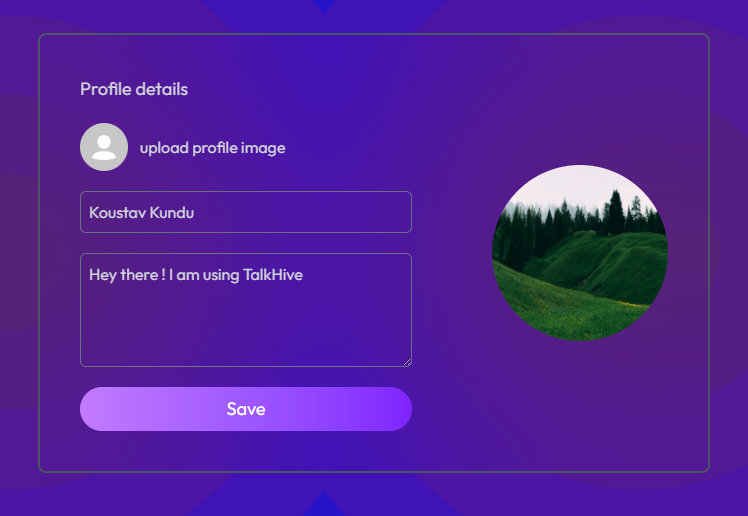
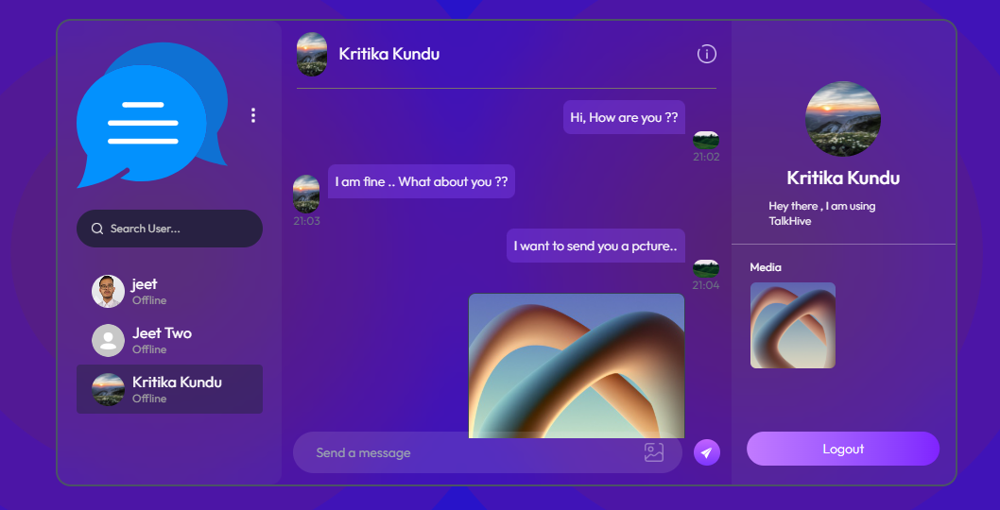

# 💬 TalkHive

**TalkHive** is a real-time, full-stack chat application designed for modern communication. With a sleek and intuitive interface, it supports secure text and media messaging and offers a smooth experience across all devices.

---

## 🚀 Live Demo

🔗 **Try it out:** [Live Demo](https://quick-chat-ecru.vercel.app/login)

---

## 📸 Screenshot

- Home Page


- Profile Page


- Chatting Page


---

## 🛠️ Tech Stack

### 🔹 Frontend
- **React.js** – Component-based UI architecture
- **Tailwind CSS** – Utility-first responsive styling
- **React Router** – Client-side routing
- **Socket.IO Client** – Real-time data handling

### 🔹 Backend
- **Node.js + Express.js** – API endpoints and server logic
- **Socket.IO** – WebSocket integration for live chat
- **MongoDB + Mongoose** – NoSQL database with schema modeling
- **JWT (JSON Web Tokens)** – Authentication and secure sessions
- **Cloudinary** – Cloud storage for media files

---

## ✨ Features

- 🔴 **Live Messaging**: Real-time communication using WebSockets
- 📸 **Media Support**: Share images and videos instantly
- 📱 **Fully Responsive**: Mobile-friendly UI for all screen sizes
- 🔐 **Authentication**: Secure login and signup with JWT
- 🕓 **Timestamps**: Clearly ordered messages with time tracking
- 💼 **Profile Management**: Personalized user experience

---

## 🧰 Getting Started

Follow these steps to set up the project locally:

### 1. Clone the Repository

```bash
git clone https://github.com/your-username/TalkHive.git
cd TalkHive
````
### 2. Setup Backend

```bash
cd server
npm install
npm run server
```

### 3. Setup Frontend

```bash
cd client
npm install
npm run dev
```

## 🌟 Credits

This project was created with ❤️ by Koustav Kundu.
If you like it, feel free to ⭐ this repository and share!
